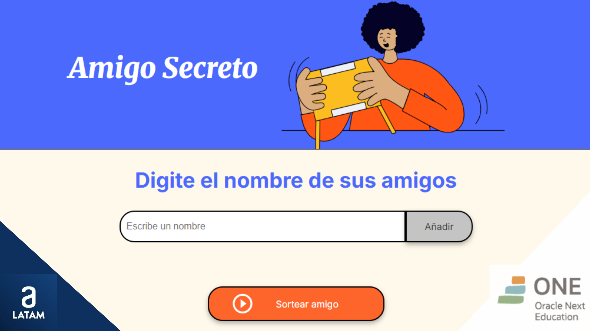
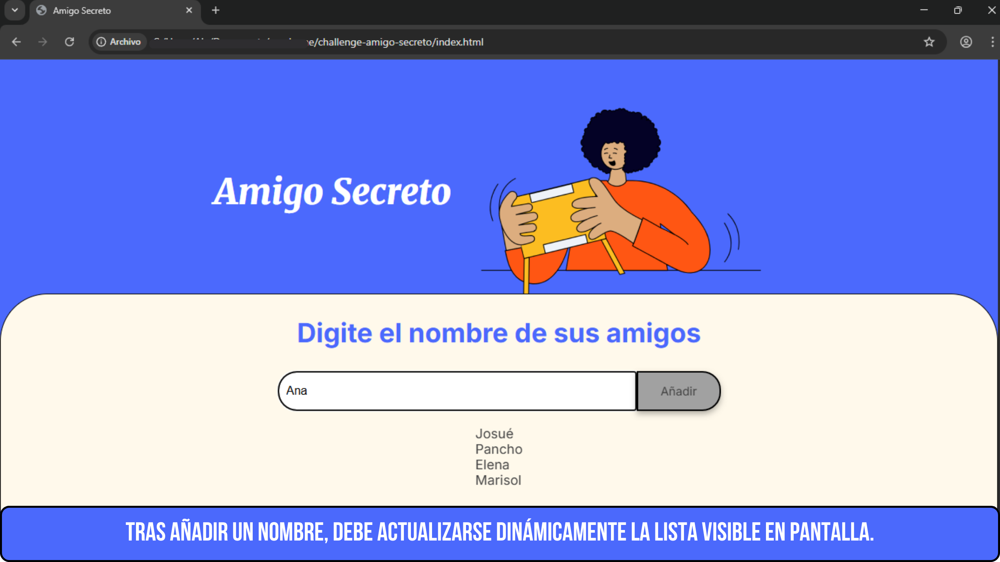
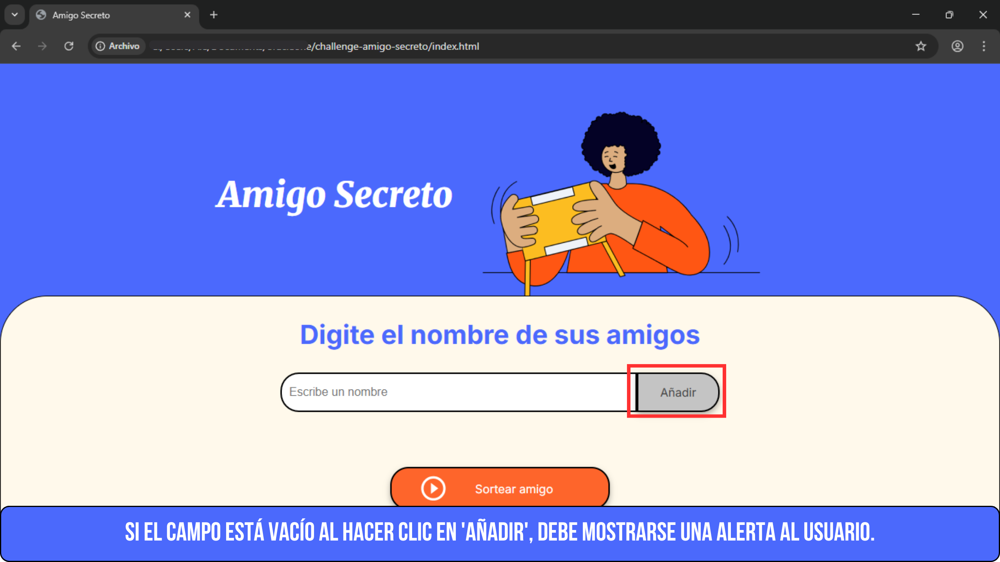
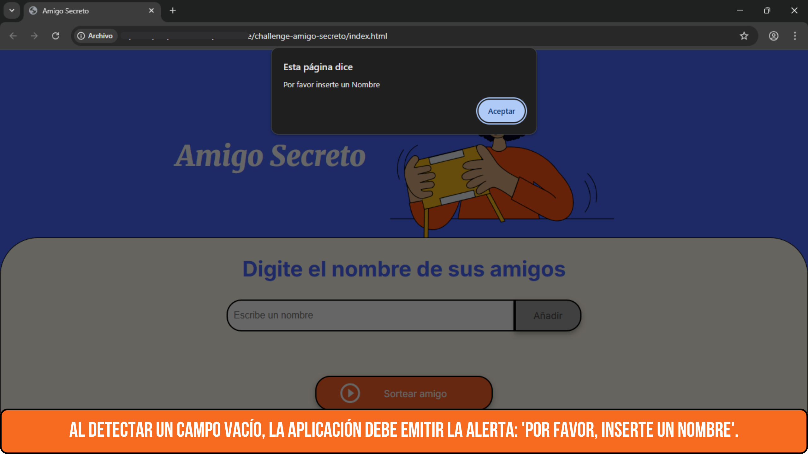
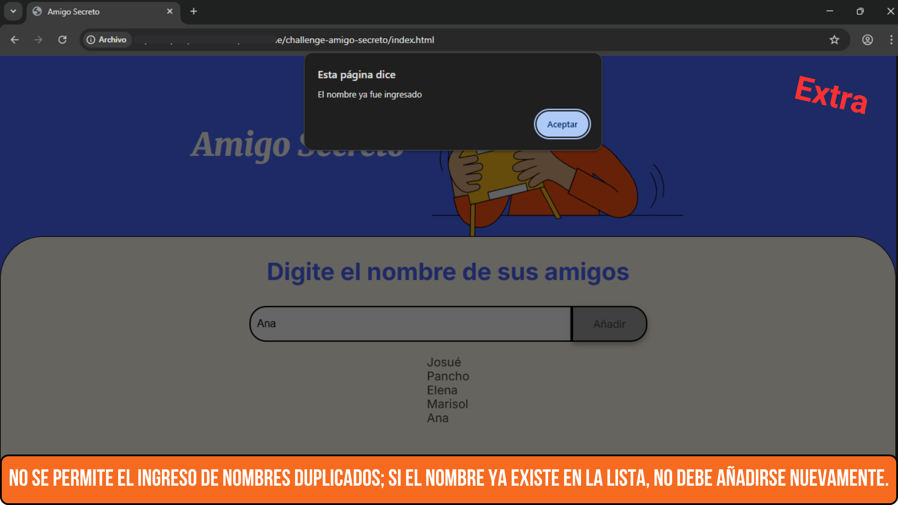
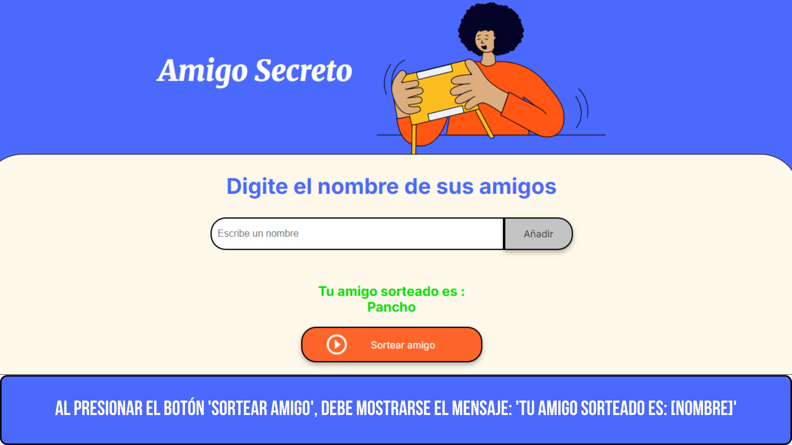
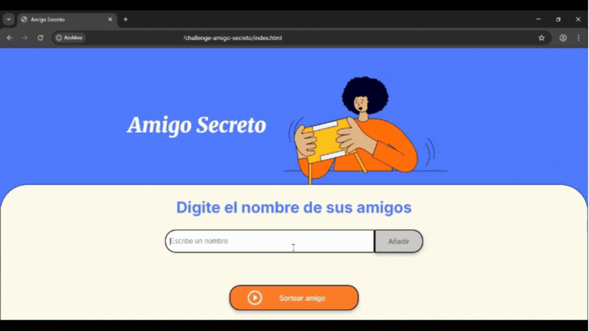

<h1 align="center"> Challenge Amigo Secreto </h1>
<p align="center">

</p>

# <h3>🪙 Insignias</h1>
 
 
 
 
 


<h3>✏️ Descripción del Proyecto</h3>
<p>"Amigo Secreto" es una divertida app web donde puedes ingresar nombres de tus amigos y dejar que el azar elija quién será el amigo secreto. Evita repeticiones, valida nombres y 
  muestra el resultado con un toque de emoción. ¡Ideal para juegos en grupo, dinámicas en fiestas o simplemente pasar un buen rato!</p>
  
<h3>📄 Características de la aplicación y demostración</h3>
<h4> Funcionalidades del proyecto</h4>

- `Agregar nombres a la lista`: Permite ingresar nombres de amigos uno por uno a través de un campo de texto y un botón. Cada nombre válido se muestra automáticamente en una lista visible.
<p align="center">

</p>
  
- `Validación de entradas`: El programa verifica que el campo no esté vacío y que el nombre no se repita. Si ocurre alguno de estos casos, se muestra una alerta al usuario.
<p align="center">



</p>

- `Sorteo aleatorio`: Al hacer clic en el botón “Sortear amigo”, el programa selecciona al azar uno de los nombres ingresados y lo muestra en pantalla con el mensaje:
"Tu amigo sorteado es: [Nombre]".
Después de mostrar el resultado, la lista de nombres en pantalla se borra automáticamente para preparar un nuevo sorteo si se desea.
<p align="center">

</p>



<h3>🚀 Acceso al Proyecto</h3>
Puedes acceder al proyecto descargando los archivos y abriendo el archivo `index.html` en tu navegador.

```bash
1. Clona este repositorio:
   git clone https://github.com/tuusuario/amigo-secreto.git](https://github.com/AleCarrilloT/challenge-amigo-secreto.git

2. Abre la carpeta del proyecto:
   cd amigo-secreto

3. Abre el archivo `index.html` en tu navegador preferido.
```

<h3>🛠️ Tecnologías Utilizadas</h3>

- 💻 [Visual Studio Code](https://code.visualstudio.com/)
- 🧪 [Git](https://github.com/)
- 🌐 HTML5
- 🎨 CSS3
- 🧠 JavaScript

<h2>🧑‍💻 Desarrollado por </h2>
✨ Alejandra Carrillo – [GitHub](https://github.com/AleCarrilloT)
